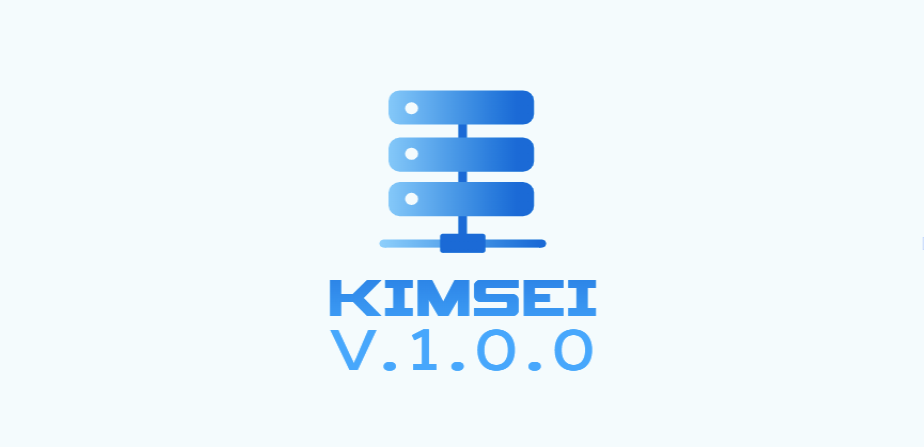

### Kimsei-Server-Development-Script ###


### Made by Kimsei https://kimsei.com (website coming soon) ###


This multi file bash script is for developing new servers and instances of 
Ubuntu with many services and automated scripts offered within this code.


### REQUIREMENTS ###
go into Kimsei/setup/:
```
cd Kimsei/setup
```
Make the setup.sh script executable
```
sudo chmod +x ./setup.sh
```
Once this is done, run the setup script:
```
sudo ./setup.sh
```
By now, you will you be able to run the script. Leave the setup directory:
```
cd ..
```
Run this command to start Kimsei`
```
sudo ./kimsei.sh
```
### License ###
[GNU General Public License v3.0](LICENSE.txt)
